# 🛡️ Armor Trim Editor

🎨 **Armor Trim Editor** is a [Blockbench](https://www.blockbench.net) plugin for painting Minecraft: Java Edition
**armor trims**. Instead of juggling two PNG files on a hand-made model, you paint directly on the exact armor model
the game uses, see every trim material while you paint, pose the player, swap skins, generate the smithing
template icon and export everything into your resource pack in one click.

<p align="center">
  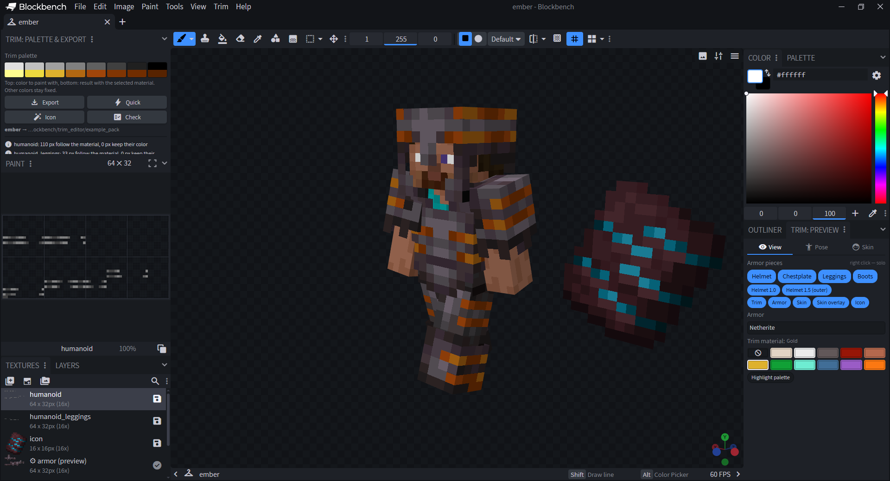
</p>

## 📋 Features

- 🧱 **Exact armor model**, taken from the game client: helmet (1.0 plus the outer 1.5 layer), chestplate (1.0),
  leggings (0.5 / 0.4, separate `humanoid_leggings` texture) and boots (0.9), with the mirrored left arm and leg.
- 🖌 **Paint only the trim.** Skin and reference armor are locked, so the brush always lands on the trim texture.
- 🌈 **Live material preview**: quartz, iron, netherite, redstone, copper, gold, emerald, diamond, lapis, amethyst
  and resin, including the `_darker` palettes used when the trim matches the armor (gold on gold, etc.).
- 🔍 **Palette highlight**: shows which pixels follow the trim material and which keep a fixed color; a **Decal**
  switch previews how a `"decal": true` pattern is clipped to the armor.
- 🛡 **Reference armor** under the trim: leather (with dye color), chainmail, iron, copper, gold, diamond,
  netherite, turtle shell or none.
- 🤸 **20 poses and animations** ported from the game's `HumanoidModel`: walking, sprinting, sneaking, riding,
  attack, bow, crossbow, shield, trident, spyglass, swimming, elytra, T-pose and more, plus two poses with the body
  parts pulled apart and head yaw/pitch sliders.
- 👤 **Skins**: all 9 default skins (wide and slim), any PNG file (legacy 64×32 skins are converted) or a
  player name.
- 🏷 **Icon generator** for the smithing template item: recolor a vanilla template (or your own icon) with a
  body and glyph color, or sample the colors from the trim.
- ✅ **Checks** before export: pixels outside the UV layout, semi-transparent pixels (trims render as cutout),
  colors that are almost but not exactly on the palette — each with a one-click fix.
- 📦 **Export to a resource pack** — a ready zip archive (with `pack.mcmeta` and `pack.png`) or a pack folder:
  both trim textures, the icon texture and model, and registration in `atlases/armor_trims.json` (keeps the file's
  indentation and path style, adds missing vanilla palettes such as `copper_darker`). Exporting another trim into
  the same archive adds it next to the others.
- 📂 **Import** trims from a resource pack folder or zip to keep editing them — one or several at once, each in its
  own tab, together with the template icon and armor icons; HD trims (128×64 and up) are supported.
- 🧥 **Armor icons**: draw how the trim looks on armor items in the inventory — seven icons, previewed on every
  armor type and trim material, with generators for a quick start. Exported in the
  [Visual Armor Trims](https://modrinth.com/resourcepack/visual-armor-trims) format, into VAT itself if your pack has it.
- 🧬 **Datapack generator**: a datapack zip with the `trim_pattern` for Minecraft 1.21.2 – 26.2 (straight into
  `saves/<world>/datapacks` if you like), pattern names in the resource pack's lang files, plus a short guide with a
  `/give` command and Paper code.
- 🌍 English and Russian interface.

## 🌈 Material preview

Only eight gray shades are recolored by the trim material. Everything else is drawn exactly as painted, so a
trim can mix material-colored parts with fixed colors. The palette panel shows what each shade turns into
with the selected material.

<p align="center">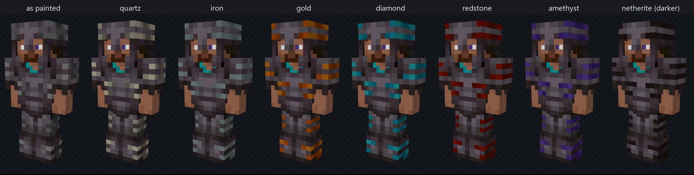</p>

| Palette key | `#E0E0E0` | `#C0C0C0` | `#A0A0A0` | `#808080` | `#606060` | `#404040` | `#202020` | `#000000` |
|---|---|---|---|---|---|---|---|---|

The preview is done in the texture shader, so it updates while you paint. The textures you export always keep
the original gray palette.

## 🤸 Poses and skins

Poses are preview-only: they move the model, never the textures, and animations pause while you paint.

<p align="center">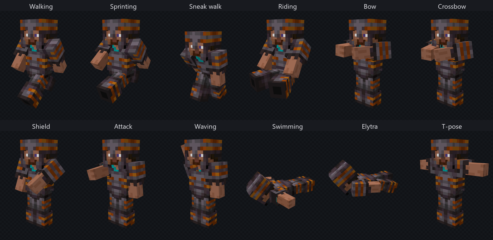</p>

*Standing* and *T-pose* also come with the body parts pulled apart, so the armor of every part can be seen and
painted on its own — including the inner sides of arms and legs:

<p align="center">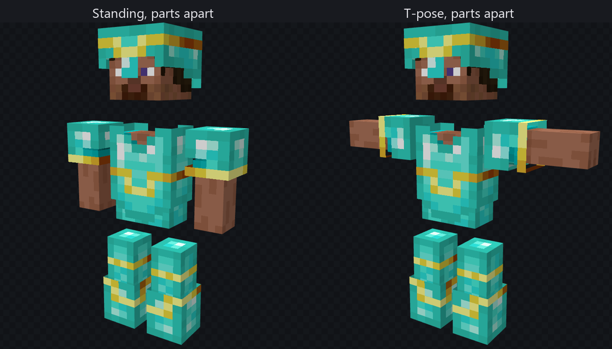</p>
<p align="center">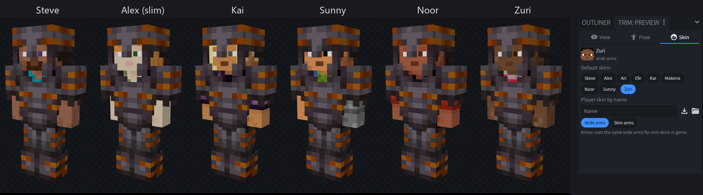</p>

## 🏷 Template icon

<p align="center">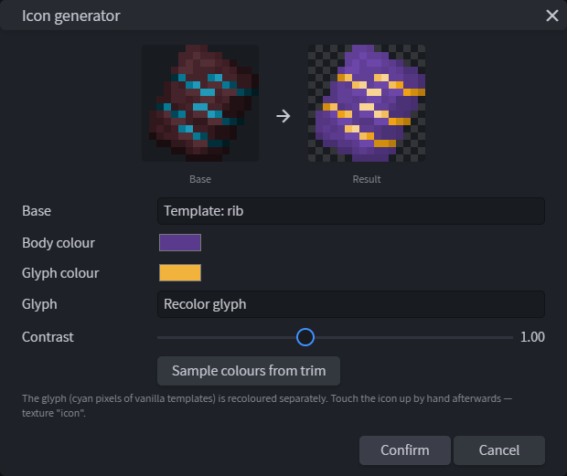</p>

The generator separates the glyph (the cyan pixels of vanilla templates) from the tablet and recolors both.
Pick a vanilla template, the current icon or an icon from your pack as the base, then touch it up by hand —
it is an ordinary 16×16 texture named `icon`.

## 📦 Export and import

<p align="center">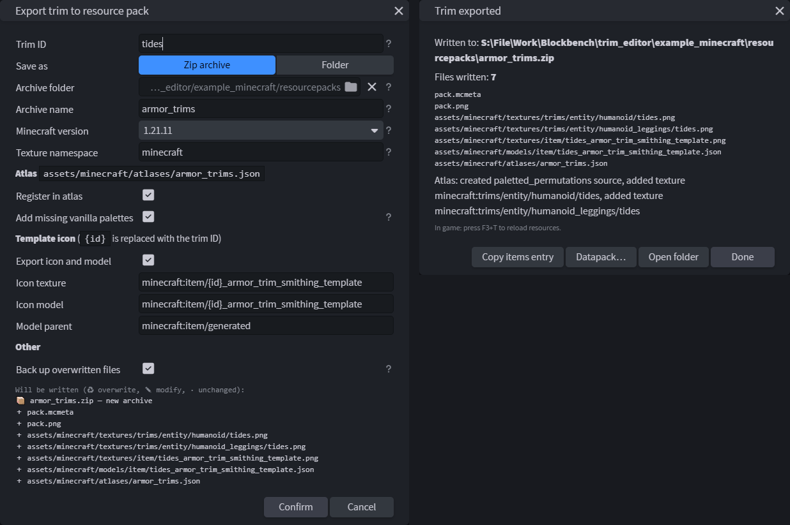</p>

The export goes into a **zip archive** (for example `.minecraft/resourcepacks/armor_trims.zip`) or into an
unpacked **folder**. A new pack gets `pack.mcmeta` for the chosen Minecraft version, a new archive also gets
`pack.png` made from the template icon. If the archive already exists it is updated: other trims and files in it
are kept. With trim ID `tides` and the default settings, an export writes:

| File | What it is |
|---|---|
| `assets/minecraft/textures/trims/entity/humanoid/tides.png` | helmet, chestplate and boots |
| `assets/minecraft/textures/trims/entity/humanoid_leggings/tides.png` | leggings |
| `assets/minecraft/textures/item/tides_armor_trim_smithing_template.png` | template icon |
| `assets/minecraft/models/item/tides_armor_trim_smithing_template.json` | icon model (`item/generated`) |
| `assets/minecraft/atlases/armor_trims.json` | adds both textures to the trim atlas |

The texture namespace, icon paths (`{id}` is replaced with the trim ID) and model parent are configurable, and
every setting is remembered. Files whose content did not change are not rewritten (images are compared by pixels,
JSON by content, and edited JSON keeps its indentation and line endings), so a pack kept in git shows only what you
really changed. Overwritten files (or the whole archive) are backed up to the Blockbench data
folder. After the first
export, **Quick export** (`Ctrl + Alt + E`) repeats it without the dialog.

The result dialog can copy an item model entry (for a `range_dispatch` on `custom_model_data`); your own item
definitions are never edited by the plugin. The only item definitions it changes are those of armor items, when
[armor icons](#-armor-icons) are exported.

<p align="center">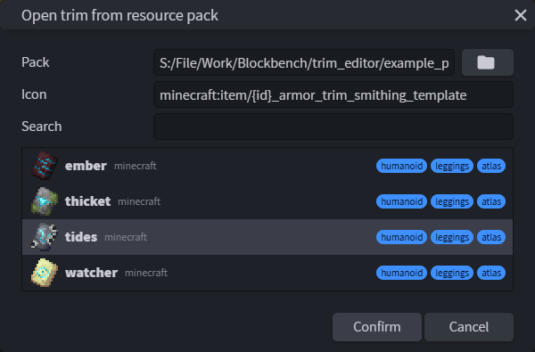</p>

## 🧥 Armor icons

In vanilla Minecraft a trimmed helmet, chestplate, leggings or boots looks the same in the inventory whatever the
pattern: only the color of one shared overlay follows the material. The **Icons** tab lets you draw how *this*
trim looks on the item icons, the way the [Visual Armor Trims](https://modrinth.com/resourcepack/visual-armor-trims)
resource pack by Thanos does it for the vanilla patterns.

<p align="center">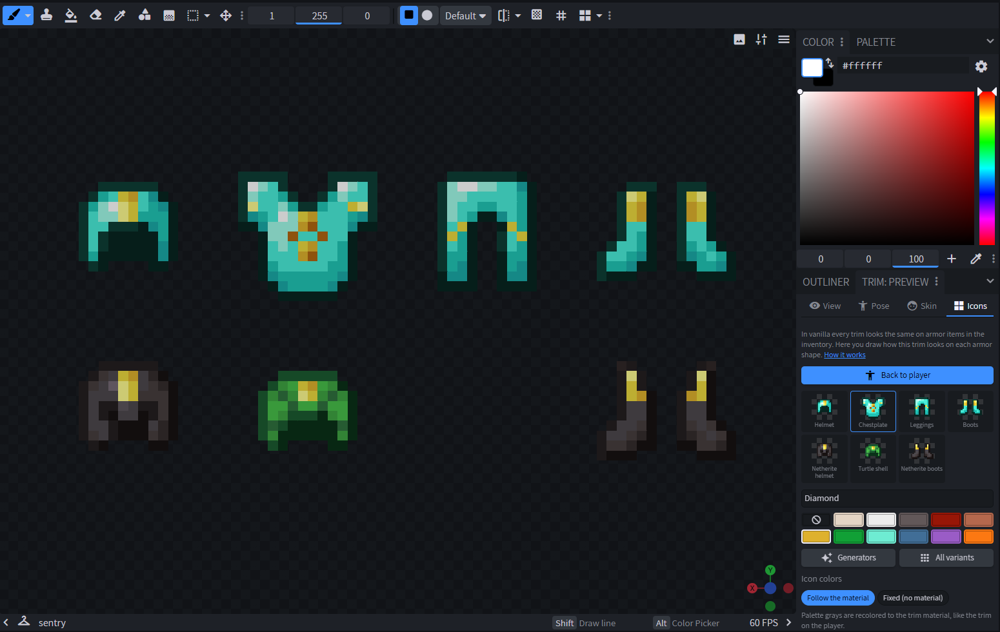</p>

- 🧩 **Seven icons.** Helmet, chestplate, leggings and boots are shared by leather, chainmail, iron, gold, diamond
  and copper armor and the netherite chestplate and leggings. The netherite helmet, turtle shell and netherite boots
  have shapes of their own and get separate icons.
- 🖌 **Paint icons** puts the icons flat in front of an orthographic camera, each on top of the armor item it
  belongs to (a locked preview). The icon textures (`icon_helmet`, `icon_chestplate`, …) can also be painted in the
  2D editor.
- 🌈 **Colors.** Palette grays follow the trim material like the trim itself, with the darker palette where the
  material matches the armor. **Fixed (no material)** keeps the icon exactly as drawn with every material, for
  colorful, non-monochrome trims.
- 🔍 **All variants** shows every armor type with every trim material and the icon as drawn.

<p align="center">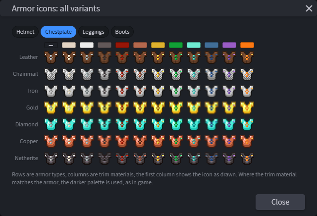</p>

### Generators

There is no need to draw every icon from scratch. A new trim starts with icons generated from the trim on the
player, and **Generators** fill any of the icons from:

| Source | What it does |
|---|---|
| From the trim on the player | fits the front view of the painted armor piece into the item silhouette |
| Vanilla overlay | the overlay the game shows for every pattern, as a base to draw on |
| Shape | outline, inner outline, stripes, diagonals, checkerboard, dots, bands or fill, clipped to the item silhouette, in a palette gray or any color |
| Copy from the common helmet and boots | fits the helmet and boots drawings into the netherite helmet, turtle shell and netherite boots |
| Clear | empties the selected icons |

The result replaces the drawing or goes on top of it, and every run is one undo step.

<p align="center">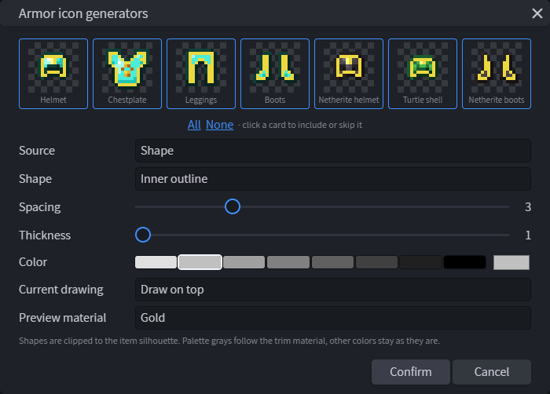</p>

### Export

Armor icons are written with the normal export (Minecraft 1.21.5 or newer; empty icons are skipped, and the
export dialog can leave them out):

- If the pack already contains **Visual Armor Trims** (also inside an overlay such as `overlay_armor_trims`), the
  trim is added to it: textures, its atlas source, models for every armor item and material (including the
  `_fallback` palette) and new cases in the armor item definitions. Exporting again replaces only this trim's
  cases.
- Otherwise the plugin writes its own item definitions for the 29 armor items, built from the vanilla ones in
  your Minecraft jar with the same layout.

| File (trim `tides`) | What it is |
|---|---|
| `textures/trims/items/<piece>_trim/minecraft/tides.png` | helmet, chestplate, leggings and boots icons |
| `textures/item/<item>/trim/minecraft/tides.png` | netherite helmet, netherite boots and turtle shell icons |
| `atlases/items.json` (`blocks.json` before 1.21.11) | paletted permutations `minecraft/<material>` and `minecraft/<material>/darker` |
| `models/item/<armor item>/minecraft/tides/minecraft/<material>.json` | one model per armor item and trim material |
| `items/<armor item>.json` | a case for the `tides` pattern with every material |

## 🧬 Datapack

A new trim pattern also has to exist on the server. **Datapack** writes it into a datapack **zip** — pick
`saves/<world>/datapacks` to put it straight into a world. An existing archive is updated and keeps its other
trims:

<p align="center">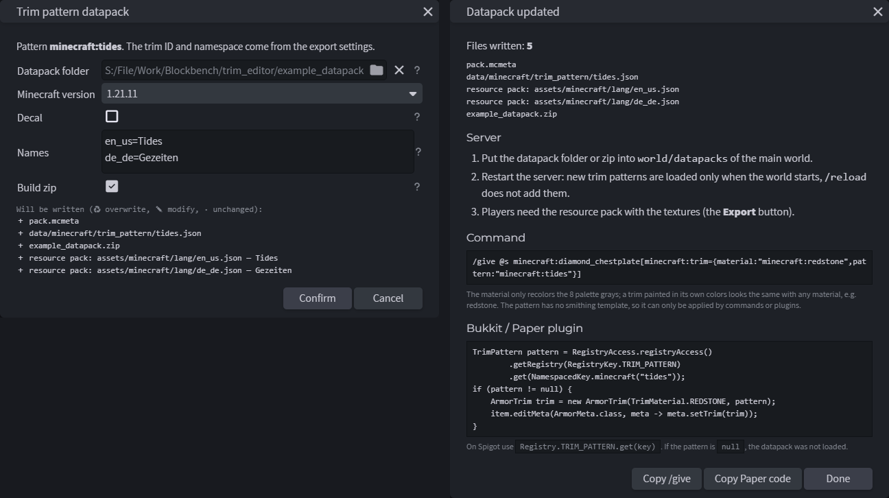</p>

| Setting | What it does |
|---|---|
| Datapacks folder + archive name | `<folder>/<name>.zip` gets `data/<namespace>/trim_pattern/<id>.json`; `pack.mcmeta` is added only if missing |
| Minecraft version | 1.21.2 – 26.2: sets the pack format and adds `template_item` for 1.21.2 – 1.21.4 |
| Decal | draw the trim only over armor pixels (the game uses an *equal* depth test, so pixels over transparent armor — including the outer helmet layer of every vanilla armor — disappear). The **Decal** switch in the *View* tab previews it |
| Names | `language=name` lines written to `assets/minecraft/lang/<language>.json` of the resource pack as `trim_pattern.<namespace>.<id>` |

The pattern gets no smithing template, so it can only be applied by commands or plugins. The result dialog
(and **Trim → How to use a trim in game**) shows what to do next:

1. Put the datapack zip into `world/datapacks` (or let the generator write it there) and **restart** the server —
   `/reload` does not add new trim patterns.
2. Give a trimmed item with a command:

   ```mcfunction
   /give @s minecraft:diamond_chestplate[minecraft:trim={material:"minecraft:redstone",pattern:"minecraft:tides"}]
   ```

3. Or apply it from a Bukkit/Paper plugin:

   ```java
   TrimPattern pattern = RegistryAccess.registryAccess()
           .getRegistry(RegistryKey.TRIM_PATTERN)
           .get(NamespacedKey.minecraft("tides"));
   if (pattern != null) {
       ArmorTrim trim = new ArmorTrim(TrimMaterial.REDSTONE, pattern);
       item.editMeta(ArmorMeta.class, meta -> meta.setTrim(trim));
   }
   ```

The material only recolors the eight palette grays, so a trim painted in its own colors looks the same with any
material. Both snippets are generated for the current trim and can be copied from the dialog.

## 🧩 How armor trims work

A trim is drawn on the same model as the armor piece it sits on, on top of it:

| Texture | Area (u, v) | Model part | Inflation | Worn with |
|---|---|---|---|---|
| `humanoid` | 0, 0 | head | 1.0 | helmet |
| `humanoid` | 32, 0 | head, outer layer | 1.5 | helmet |
| `humanoid` | 16, 16 | body | 1.0 | chestplate |
| `humanoid` | 40, 16 | arms | 1.0 | chestplate |
| `humanoid` | 0, 16 | legs | 0.9 | boots |
| `humanoid_leggings` | 16, 16 | body (waist) | 0.5 | leggings |
| `humanoid_leggings` | 0, 16 | legs | 0.4 | leggings |

- ⛑️ **Two helmet layers.** The left half of the top row is the helmet itself; the right half is an outer layer
  that floats 0.5 px above it. Toggle them separately in the *View* tab.
- ↔️ **Left and right limbs share one area**, mirrored, so they cannot differ.
- 🎨 **Palette.** Only the eight grays above are recolored. A material that matches the armor (gold trim on gold
  armor) uses its `_darker` palette.
- 🔲 **Transparency.** Trims render as cutout: alpha below 10% disappears, anything else becomes fully opaque.
- 🖥 **Server side.** The pattern itself is registered by a datapack (`data/<namespace>/trim_pattern/<id>.json`
  with `asset_id` = `<namespace>:<id>`), see [Datapack](#-datapack).
- 🗂 **Versions.** The resource pack layout used here (`trims/entity/humanoid`) exists since 1.21.2.

## 🚀 Installation

Requires the **desktop** version of Blockbench **5.0 or newer**.

1. Download [`armor_trim_editor.js`](armor_trim_editor/armor_trim_editor.js).
2. In Blockbench open **File → Plugins**, click the *Load plugin from file* icon and pick the file.
3. When asked, allow file access — the plugin needs it to read the Minecraft jar and to write into your pack.

### Minecraft jar

Default skins, reference armor, vanilla trims and template icons are read at runtime from your own Minecraft
client jar; nothing from the game is bundled with the plugin. The jar is found automatically in:

- the official launcher (`.minecraft/versions`),
- Prism Launcher, PolyMC and MultiMC (including portable installs in common folders),
- jars downloaded by other Blockbench plugins.

Choose a different one in **Trim → Settings**. Without a jar the plugin still works with a plain mannequin
skin and flat-colored reference armor.

## 🛠 Usage

1. **File → New → Armor Trim** (or **Trim → New trim**). Start empty or from a vanilla pattern.
   To edit an existing trim use **Trim → Open trim from resource pack** (a folder or a zip).
2. Paint in the 3D view or on the `humanoid` / `humanoid_leggings` textures in the 2D editor. Use the palette
   panel for material-colored pixels. Right-click an armor piece in the *View* tab to show only that piece —
   useful for leggings, which sit under the chestplate and boots.
3. Check the result with different materials, armor, poses and skins.
4. Make the template icon with **Icon**.
5. Draw the armor icons in the *Icons* tab, or tweak the generated ones.
6. **Export**, then press `F3 + T` in game.
7. **Datapack** once per new trim, then restart the server and give the trim with `/give` or your plugin.

The `.bbmodel` file keeps everything — textures, preview settings and export settings.

## 🌍 Localization

- 🇺🇸 **English** — default
- 🇷🇺 **Russian** — full translation

The interface follows the Blockbench language. More languages can be added in `getTranslations()` at the end
of the plugin file.

## 📄 License

[GPL-3.0](LICENSE). Not affiliated with Mojang or Microsoft. Minecraft assets stay in your own game files.
